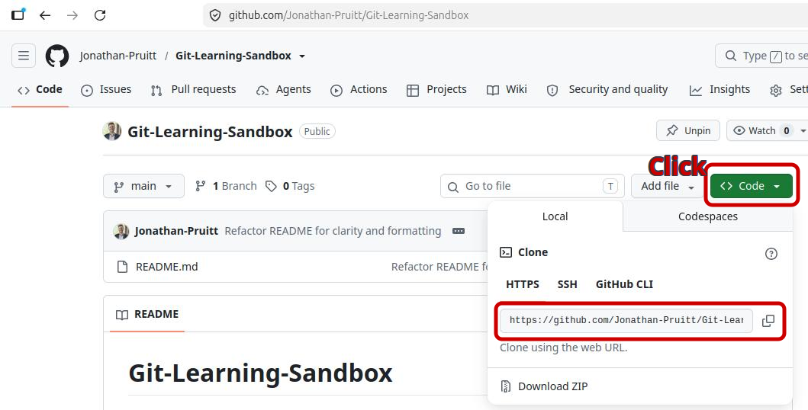

# This project is currently a Work In Progress
I will be updating these instructions soon.

Thank you for your patience!
-Jonathan Pruitt | Better Tomorrow With Jonathan

# Git-Learning-Sandbox

This sandbox will offer a safe and accessible place to gain hands-on experience with git using command-line interface (CLI) without the fear of breaking someone else's (or your own) codebase and/or project data.

## Who is this Repo/Project For?

This repo is built for **Git beginners** looking for a **zero-stakes playground**. If you want to practice basic command-line navigation, branching, and submitting pull requests without worrying about damaging a real codebase, you are in the right place.

## What are the Learning Goals of this Repo/Project?

This repo hopes to help you:
    
- Develop a **basic** understanding of using Bash to create and navigate files/folders on your local machine (a.k.a. your personal laptop/desktop)
    - Basic commands include: ls, cd, mkdir, rm, rmdir, mv, cp, nano, touch
- Understand and use the basic **git** commands
  - Sending/Receiving Repository Data
    - `git clone`, `git fetch`, `git pull`, `git commit`, `git push`, `git merge`
  - Navigating the git version control structure
    - `git branch`, `git checkout`, `git switch`, `git branch`
  - Monitoring and Status Reports
    - `git status`, `git diff`
- Develop a level of comfortability with all of the listed (and unlisted) commands so you can more confidently use git within your own personal/professional projects.

# Getting Started

## Using Command-Line Interface (CLI)

*If you already feel comfortable navigating and interacting with your computer using only the terminal, please skip down to [Starting With Git](#starting-with-git)*

Two common ways to manage repositories on GitHub are the GitHub Desktop app *(not covered by this project)* and using **git command-line interface** (CLI). Therefore, it is important for you to know how to use your terminal. For the sake of consistency, I will be using Bash for any examples of terminal-based commands (other command-line tools you might be familiar with include Windows' PowerShell and Command Prompt or Apple's macOS zsh), so if you are *completely* unfamiliar with using your terminal I would recommend following the instructions in the next paragraph to set up Bash.

If you're using Linux/Unix, you likely already have Bash pre-installed. Otherwise, I recommend you go to [W3Schools - Getting Started with Bash](https://www.w3schools.com/bash/bash_getstarted.php) to help you install Bash.

### Why Should We Use CLI?

The terminal and command-line are powerful tools for swiftly and efficiently navigating and interacting with your computer (especially if you are a proficient and fast typist). From the terminal, you are able to create and delete files/folders, navigate your computer's file system, and run commands (like git) **all without needing to touch a mouse!** Learn more about Command-Line Interface [HERE for W3Schools](https://www.w3schools.com/whatis/whatis_cli.asp) and [HERE for Wikipedia](https://en.wikipedia.org/wiki/Command-line_interface)

## Starting With Git <a id='starting-with-git'/>

### Setting up your Local Environment

#### Step 1. Open your terminal

- **Windows**: `windows key` + R then type 'cmd' and press `enter`
- **Linux (Ubuntu/Debian/GNOME)**: `ctrl` + `alt` + T
- **macOS**: `cmd` + `spacebar` then type 'Terminal' and press `enter`

  **HINT** Whenever you see text in `this format`, that will likely be a 'terminal command' and you'll want to *run* that command in the terminal we just opened (a.k.a. run the command using command-line interface [CLI]).

#### Step 2. Choose a location for your project. 

*In this step I have included a **'TDLR'** section showing just the commands, as well as an **'explanation'** section to explain the actions taken*
  
*You will notice that the command line of your terminal likely has a **path** to the left of the cursor [it probably looks something like **C:\\{your-computer's-name}\\Documents>** or **{your-computer's-name}@:~/$** or something along those lines]. The path signifies your current working directory (i.e. the location within your computer's file structure where your terminal is currently active/working)*

##### TLDR STEP 2 (Commands)

**Visualize** your current working directory (to get your bearings)

    `ls`

**Make** (or choose) an empty folder/directory then enter that directory

    `mkdir learning` # makes a directory called 'learning'
    `cd learning` # enters into the 'learning' directory

##### VERBOSE STEP 2 (Explaining the actions)

In 'Bash', you can use `ls` to **visualize** the all of the files and folders that are present in your current working directory (cwd).
- If you want to set up your project in a *different* directory, you can either **change directory** using `cd` *or* you can make a **new directory** with `mkdir`
  - Example: 
    - If your cwd is `~/Documents` and you want to set up your project in an existing folder at `~/Documents/learning`, you would run: `cd learning` (or cd `./learning`) to *change directory*
    - If the folder 'learning' did NOT exist yet, you could run `mkdir learning`, which would create the empty 'learning' folder, THEN use `cd learning` to step into the 'learning' directory.

### Installing Git

#### Initial Check if Git is Installed
Before attempting to install, let's see if you already have **git** on your system by checking if the `git -v` (or `git --version`) command will return a version. 

    `git -v`

If it returns something like: `git version {number}.{number}.{number}` (e.g. `git version 2.43.0`), then it is already installed and you can skip to [Cloning this Repository](#cloning-this-repository). Otherwise, continue reading...

#### Windows

You can either use a classic 'install wizard' by following the installation instructions and download at [the official Git website](https://git-scm.com/download/win), **OR** you can install git using the `winget` packet manager
    
    `winget install --id Git.Git -e --source winget`

#### Linux (Ubuntu/Debian)

First, update your system's package index (to ensure your system knows the exact location of the latest software versions and their dependencies, decreasing the risk of installation errors)

    `sudo apt update` 
    # the *sudo* (a.k.a. 'Super Do') prefix modifies the security context of the command (escalating your current level of permissions to the 'admin' level for the duration of this command)
Next, run the install command for git by commanding the advanced package tool (`apt`) to `install` the `git` package 

    `sudo apt install git`

#### Verify Git

Now that you've attempted an install, verify that the installation was successful by running:

    `git --version`
    # or 
    `git -v`
    # If a version number is returned, the installation was successful.

# Using Git

>One way to visualize the version control aspects of git is to imagine that you and a few friends took a vacation, and you wanted to create a collaborative **journal** to track the events of the vacation. Each friend would have their own *personal* journal that they would write **journal entries** in it throughout the day, and there would be one **main** journal that would act as the unifying hub for all of the collaborators' journal entries. Each friend would be able to transfer their journal entries into the **main** journal, and each friend would be able to copy the entirety of the journal into their personal notebook so they could have access to all of the journal entries from each other friend. Throughout the vacation, the main journal would collect the incoming journal entries, keeping track of which notebook the entry was transfered from and what time that entry was written. And at the end of the journey, the **main** journal would be representative of the entire vacation as experienced by each friend, but sharing one universally available location.

>In this imperfect analogy, the **main** journal is the git repository's **'remote'** presence (the repository as it exists online [e.g. GitHub]). Each friends individual journal is liken to a **local repository** (a.k.a. the repo as it exists on an individual device [or more precisely, as it exists within an individual directory]), and each individual journal entry is a **commit**. When a local repository (a.k.a. individual journal) has fallen out of sync with **main** (because there have been recent activities either on the local or the remote), the local can **'fetch'** the current state of **main** identify the differences. Next, the local can **pull** from main (a.k.a. copy the current state of the journal)

So! Let's clone this repository, and start getting comfortable using git to interatct with a master project in a collaborative environment.

## Cloning this Repository

Continuing my above analogy, *this* repository is like *our* collaborative journal. Fortunately for you (and me), neither of us intends to keep any important files in this repo, so we can feel free to interact with this repo without fear!

And now that we've **selected** a location for our project and we've confirmed that **git** is installed, let's clone the repository.

>DEFINITION: To **'clone'** a repository (simply put) means to **create** a copy of the current repository (the files and file structure) as it exists on GitHub (or other applicable **git** host) and pasting those files/structure onto your device (along with all of the basic **git** infrastructure).
>IMPORTANT NOTE: Cloning a repo **creates** the **initial version** of that repository on your local device. Once cloned, updating your local and/or the main is done primarily with the **'pull'** and **'push'** commands.

This image shows where on the GitHub platform you can find the information you will need to clone a public repo:

Now that you've seen where to find a target repo's address, here's the command to clone *this* repo using HTTPS protocol *(there are other methods of cloning repos, but HTTPS offers a simple starting point)*:

    `git clone https://github.com/Jonathan-Pruitt/Git-Learning-Sandbox.git`

After cloning the repo, you can see that it's present on your computer now by looking at your file explorer or by running the `ls` command in the terminal.

    `ls`
    # *You should see a list of files/folders in your current directory and one of the folders will be the repo you just cloned*
    # *(e.g. Git-Learning-Sandbox)*

You have now established an initial **connection** to this repository, and copied all of its contents (as of the moment of cloning) onto your local device. 

## Fetching and Pulling

## Pushing to the Repo
